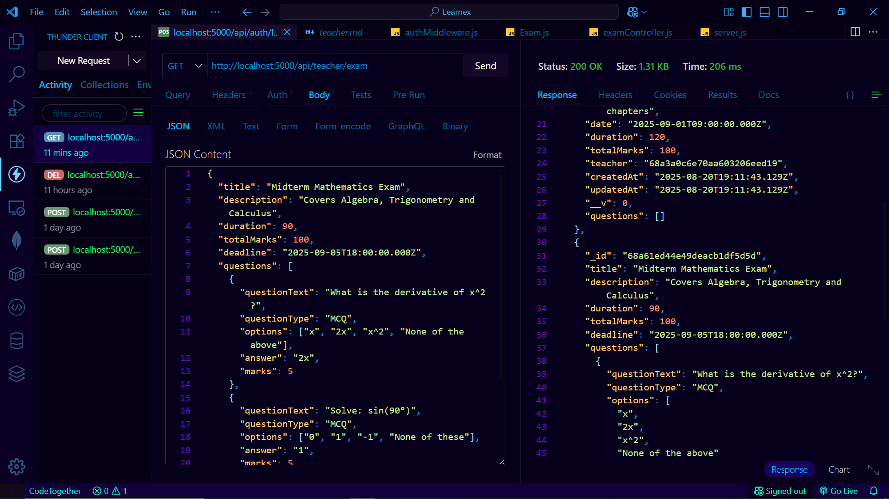

## taecher profile
 Test on Postman

### **Get Teacher Profile**

`GET http://localhost:5000/api/teacher/profile`
Headers → `Authorization: Bearer <token>`
Response:

```json
{
  "_id": "abc123",
  "name": "Nova Teacher",
  "email": "nova@school.com",
  "role": "teacher",
  "institution": "LPU",
  "subject": "Mathematics"
}
```

### **Update Teacher Profile**

`PUT http://localhost:5000/api/teacher/profile`
Headers → `Authorization: Bearer <token>`
Body (JSON):

```json
{
  "name": "Nova Ma’am",
  "institution": "National Inter College",
  "subject": "Physics"
}
```

Response:

```json
{
  "msg": "Profile updated successfully",
  "name": "Nova Ma’am",
  "institution": "National Inter College",
  "subject": "Physics"
}
```


### notes:
Step 5: Test in Postman
1. Create Note

POST http://localhost:5000/api/notes
Headers → Authorization: Bearer <teacherToken>
Body (JSON):

{
  "title": "Introduction to AI",
  "content": "AI is the simulation of human intelligence..."
}

2. Get Teacher Notes

GET http://localhost:5000/api/notes
Headers → Authorization: Bearer <teacherToken>

3. Update Note

PUT http://localhost:5000/api/notes/:id
Body:

{
  "title": "Intro to AI (Updated)",
  "content": "Updated content..."
}

4. Delete Note

DELETE http://localhost:5000/api/notes/:id


### assignment
Step 5: Test in Postman
1. Create Assignment

POST http://localhost:5000/api/assignments
Headers → Authorization: Bearer <teacherToken>
Body (JSON):

{
  "title": "Math Assignment 1",
  "description": "Solve all algebra questions",
  "deadline": "2025-08-25T23:59:59.000Z",
  "fileUrl": "https://example.com/math1.pdf"
}

2. Get Teacher Assignments

GET http://localhost:5000/api/assignments
Headers → Authorization: Bearer <teacherToken>

3. Update Assignment

PUT http://localhost:5000/api/assignments/:id

{
  "title": "Math Assignment 1 (Updated)",
  "description": "Solve updated algebra questions"
}

4. Delete Assignment

DELETE http://localhost:5000/api/assignments/:id


// teacher announcement

### ✅ Backend API Testing (Postman / Thunder Client / cURL)

1. **Create Announcement**

   * **POST** → `/api/teacher/announcements`
   * Body (JSON):

     ```json
     {
       "title": "Important Exam Update",
       "message": "Midterm exams will start from 1st September. Please prepare well.",
       "audience": "all"   // or "class-10", "group-study-xyz"
     }
     ```
   * Expected Response:

     ```json
     {
       "success": true,
       "announcement": {
         "_id": "...",
         "title": "Important Exam Update",
         "message": "Midterm exams will start from 1st September. Please prepare well.",
         "audience": "all",
         "createdBy": "teacherId",
         "createdAt": "2025-08-19T..."
       }
     }
     ```

2. **Get All Announcements**

   * **GET** → `/api/teacher/announcements`
   * Expected Response:

     ```json
     [
       {
         "_id": "...",
         "title": "Important Exam Update",
         "message": "Midterm exams will start from 1st September. Please prepare well.",
         "audience": "all",
         "createdAt": "..."
       }
     ]
     ```

3. **Delete Announcement (if needed)**

   * **DELETE** → `/api/teacher/announcements/:id`

---


### create exam:



### my exam:
## **1️⃣ Create an Exam**

**Endpoint:**

```
POST /api/teacher/exams
```

**Headers:**

```json
{
  "Authorization": "Bearer <JWT_TOKEN>"
}
```

**Body:**

```json
{
  "title": "Midterm Mathematics Exam",
  "description": "Covers Algebra, Trigonometry and Calculus",
  "duration": 90,
  "totalMarks": 100,
  "deadline": "2025-09-05T18:00:00.000Z",
  "questions": [
    {
      "questionText": "What is the derivative of x^2?",
      "questionType": "MCQ",
      "options": ["x", "2x", "x^2", "None of the above"],
      "answer": "2x",
      "marks": 5
    },
    {
      "questionText": "Solve: sin(90°)",
      "questionType": "MCQ",
      "options": ["0", "1", "-1", "None of these"],
      "answer": "1",
      "marks": 5
    }
  ],
  "gradeSettings": [
    { "grade": "A", "minPercentage": 90, "maxPercentage": 100 },
    { "grade": "B", "minPercentage": 80, "maxPercentage": 89 },
    { "grade": "C", "minPercentage": 70, "maxPercentage": 79 },
    { "grade": "F", "minPercentage": 0, "maxPercentage": 69 }
  ]
}
```

✅ **Expected Response:** 201 Created

```json
{
  "_id": "EXAM_ID",
  "title": "Midterm Mathematics Exam",
  "description": "Covers Algebra, Trigonometry and Calculus",
  "duration": 90,
  "totalMarks": 100,
  "deadline": "2025-09-05T18:00:00.000Z",
  "questions": [...],
  "gradeSettings": [...],
  "teacher": "TEACHER_ID",
  "createdAt": "...",
  "updatedAt": "..."
}
```

---

## **2️⃣ Get All Exams**

**Endpoint:**

```
GET /api/teacher/exams
```

**Headers:**

```json
{
  "Authorization": "Bearer <JWT_TOKEN>"
}
```

✅ **Expected Response:** 200 OK

```json
[
  {
    "_id": "EXAM_ID",
    "title": "Midterm Mathematics Exam",
    "description": "...",
    "teacher": "TEACHER_ID",
    ...
  },
  ...
]
```

---

## **3️⃣ Get Single Exam**

**Endpoint:**

```
GET /api/teacher/exams/:id
```

**Example:**

```
GET /api/teacher/exams/EXAM_ID
```

✅ **Expected Response:** 200 OK

```json
{
  "_id": "EXAM_ID",
  "title": "Midterm Mathematics Exam",
  "questions": [...],
  "gradeSettings": [...],
  "teacher": "TEACHER_ID"
}
```

---

## **4️⃣ Update Exam**

**Endpoint:**

```
PUT /api/teacher/exams/:id
```

**Body Example:**

```json
{
  "title": "Updated Math Midterm",
  "duration": 100
}
```

✅ **Expected Response:** 200 OK

```json
{
  "_id": "EXAM_ID",
  "title": "Updated Math Midterm",
  "duration": 100,
  ...
}
```

---

## **5️⃣ Update Grade Settings**

**Endpoint:**

```
PUT /api/teacher/exams/:id/grades
```

**Body Example:**

```json
{
  "gradeSettings": [
    { "grade": "A+", "minPercentage": 95, "maxPercentage": 100 },
    { "grade": "A", "minPercentage": 90, "maxPercentage": 94 }
  ]
}
```

✅ **Expected Response:** 200 OK

```json
{
  "msg": "Grade settings updated",
  "gradeSettings": [...]
}
```

---

## **6️⃣ Get Grade Settings**

**Endpoint:**

```
GET /api/teacher/exams/:id/grades
```

✅ **Expected Response:** 200 OK

```json
[
  { "grade": "A+", "minPercentage": 95, "maxPercentage": 100 },
  { "grade": "A", "minPercentage": 90, "maxPercentage": 94 }
]
```

---

## **7️⃣ Get Exam Results**

**Endpoint:**

```
GET /api/teacher/exams/:id/results
```

✅ **Expected Response:** 200 OK

```json
[
  {
    "_id": "RESULT_ID",
    "examId": "EXAM_ID",
    "studentId": {
      "_id": "STUDENT_ID",
      "name": "John Doe",
      "email": "john@example.com"
    },
    "score": 85,
    "answers": [...],
    "visible": true
  }
]
```

---

## **8️⃣ Toggle Result Visibility**

**Endpoint:**

```
PATCH /api/teacher/exams/:id/results/:resultId/toggle
```

✅ **Expected Response:** 200 OK

```json
{
  "msg": "Result visibility updated",
  "visible": false
}
```

---

## **9️⃣ Delete Exam**

**Endpoint:**

```
DELETE /api/teacher/exams/:id
```

✅ **Expected Response:** 200 OK

```json
{
  "msg": "Exam deleted successfully"
}
```

---


### studysession
-create: http://localhost:5000/api/study-sessions


{
  "title": "Math Practice Session",
  "subject": "Mathematics",
  "description": "Algebra & Trigonometry practice for exam.",
  "maxParticipants": 10,
  "scheduledDateTime": "2025-09-01T14:00:00.000Z",
  "duration": 60
}


